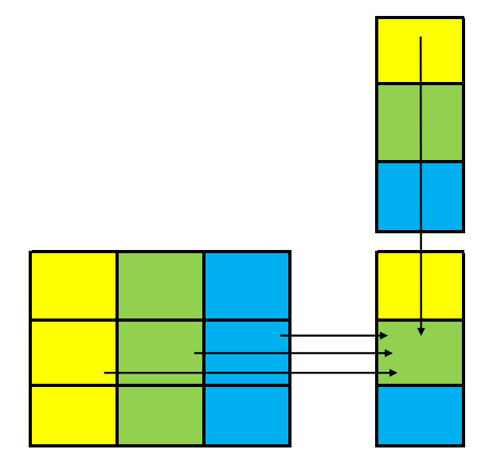
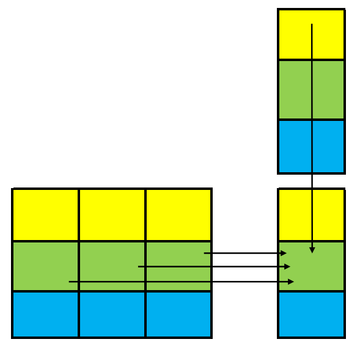
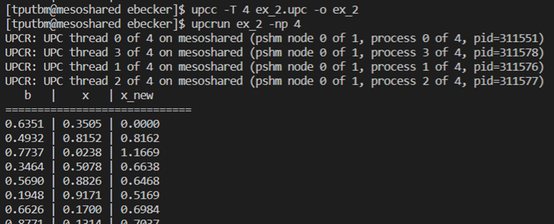
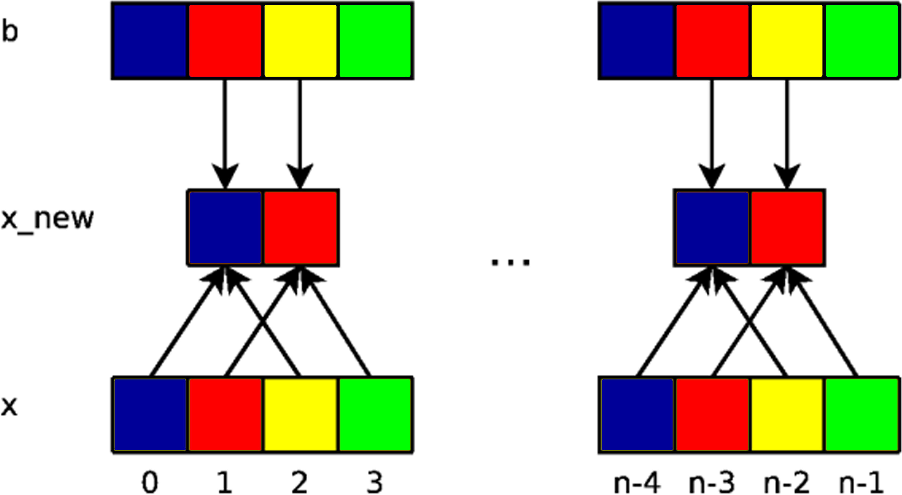
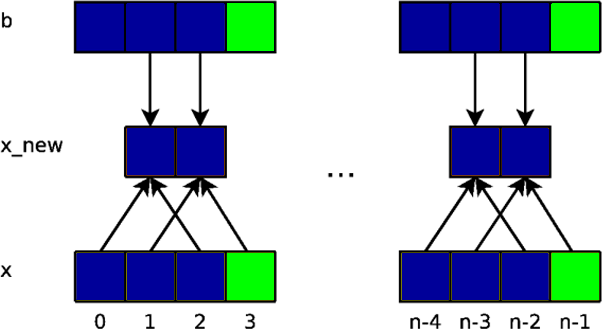
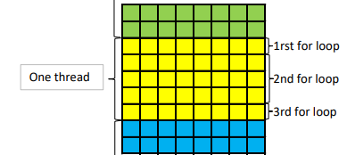

# Introduction

This document is a report of the PC40 UV at the UTBM. All the test was
run on the [mesocentre de calcul
Franche-Compté](https://www.univ-fcomte.fr/informatique-calcul/mesocentre-de-calcul)
with 32 execution cores and 64 GB of RAM.

# Work sharing, synchronization

## Conversion table

To optimize the code we can parallelize the for loop. To do it correctly
we will not use a test in the loop to distribute the work but change the
initiation and the step of the for loop. We have to add a upc_barrier to
be sure all the work is finished before the results are printed.

``` objectivec
#include <stdio.h>
#include <upc.h>
#define TBL_SZ 12

int main(){
    static shared int fahrenheit[TBL_SZ];
    static shared int step=10; 
    int celsius, i;

    //Create the conversion table
    upc_forall(i=MYTHREAD;i<TBL_SZ;i+=THREADS;i){
        celsius=step*i;
        fahrenheit[i]=celsius*(9.0/5.0)+32;
    }
    //Sync all threads
    upc_barrier;

    //Print the conversion table
    if(MYTHREAD==0)

    for(i=0;i<TBL_SZ;i++){
        celsius=step*i;
        printf("%d \t %d \n", fahrenheit[i], celsius);
    }
}
```

# Shared arrays, blocked shared arrays

## Vector addition

To add two vector vector we can share the work between threads.

``` objectivec
#include<upc_relaxed.h> 
#define N 100 
shared int v1[N], v2[N], v1plusv2[N]; 
void main() 
{ 
    int i; 
    for(i=0;i<N;i++){
        if(MYTHREAD==i%THREADS) 
        v1plusv2[i]=v1[i]+v2[i] ; 
    }
}
```

We can change the loop to avoid the code doing a check for each
iteration.

``` objectivec
#include<upc_relaxed.h> 
#define N 100 

shared int v1[N], v2[N], v1plusv2[N]; 
void main() 
{ 
    int i; 
    for(i=MYTHREAD; i<N; i+=THREADS){
        v1plusv2[i]=v1[i]+v2[i] ; 
    }
}
```

The shared data are distributed in round rubbish fashion. Here the
default distribution yields is an efficient implementation in this case

## Matrix vector multiplication

``` objectivec
shared int a[THREADS][THREADS] ; //Matrix A
shared int b[THREADS], c[THREADS] ; //Vector B and C
void main (void) 

{
    int i, j; 
    //Using upc_forall to share the work
    upc_forall( i = 0 ; i < THREADS ; i++; i){
    c[i] = 0;
        for ( j= 0 ; j < THREADS ; j++){
            c[i] += a[i][j]*b[j];
        }
    }
}
```

Here the data are not well distributed.

 <span id="fig1"
label="fig1"></span>

To optimise the code we can change the BLOCKSIZE of the matrix a

``` objectivec
// vect_mat_mult.c
#include <upc.h>
shared [THREADS] int a[THREADS][THREADS] ; //Matrix A with a different blocksize
shared int b[THREADS], c[THREADS] ; //Vector B and C
void main (void) 

{
    int i, j; 
    //Using upc_forall to share the work
    upc_forall( i = 0 ; i < THREADS ; i++; i){
    c[i] = 0;
        for ( j= 0 ; j < THREADS ; j++){
            c[i] += a[i][j]*b[j];
        }
    }
}
```

 <span id="fig2"
label="fig2"></span>

# Simplified 1D Laplace solver

## The 1D solver in UPC

To implement the 1D in UPC we can to the following code:

``` objectivec
#include <upc_relaxed.h>
#include <stdio.h>
#include <stdlib.h>
#include <time.h>

#define TOTALSIZE 	800

//== declare the x, x_new, b arrays in the shared space with size of TOTALSIZE
shared double x[TOTALSIZE];
shared double x_new[TOTALSIZE];
shared double b[TOTALSIZE];

void init();

int main(int argc, char **argv){
    int j;

    init();
    upc_barrier;

    //== add a for loop which goes through the elements in the x_new array
    for( j=1; j<TOTALSIZE-1; j++ ){
        //== insert an if statement to do the work sharing across the threads
        if( j % THREADS == MYTHREAD){
            x_new[j] = 0.5*( x[j-1] + x[j+1] + b[j] );
        }
    }

    //Print the result with the first thread
    if( MYTHREAD == 0 ){
        printf("   b   |    x   | x_new\n");
        printf("=============================\n");

        for( j=0; j<TOTALSIZE; j++ )
            printf("%1.4f | %1.4f | %1.4f \n", b[j], x[j], x_new[j]);
    }

    return 0;
}

void init(){
    int i;

    if( MYTHREAD == 0 ){
        srand(time(NULL));

        for( i = 0; i<TOTALSIZE; i++ ){
            b[i] = (double)rand() / RAND_MAX;
            x[i] = (double)rand() / RAND_MAX;
        }
    }
}
```

This implementation isn’t optimise cause each thread will check an IF
statement even if it’s not there work. To avoid the race condition, we
can add two upc_barrier, one after the initialisation and another before
the printing

 <span id="fig3" label="fig3"></span>

## Optimize the code

### Avoiding the if condition

To avoid the code to check an if condition we can use the following
code:

``` objectivec
for(int j=MYTHREAD; j<TOTALSIZE-1; j+=THREADS ){
        x_new[j] = 0.5*( x[j-1] + x[j+1] + b[j] );
    }
```

### Blocked arrays

To optimize the memory distribution we can set a BLOCKSIZE

``` objectivec
#include <upc_relaxed.h>
#include <stdio.h>
#include <stdlib.h>
#include <time.h>

#define BLOCKSIZE 16

//==> declare the x, x_new and b arrays in the shared space with size of 
//    BLOCKSIZE*THREADS and with blocking size of BLOCKSIZE
shared [BLOCKSIZE] double x[BLOCKSIZE*THREADS];
shared [BLOCKSIZE] double x_new[BLOCKSIZE*THREADS];
shared [BLOCKSIZE] double b[BLOCKSIZE*THREADS];

void init();

int main(int argc, char **argv){
    int j;

    init();
    upc_barrier;
    //==> insert a upc_forall statement to do work sharing while 
    //    respecting the affinity of the x_new array
    upc_forall( j=1; j<(BLOCKSIZE*THREADS)-1; j++; &x_new[j] ){
        x_new[j] = 0.5*( x[j-1] + x[j+1] + b[j] );
    }
    upc_barrier;

    if( MYTHREAD == 0 ){
        printf("   b   |    x   | x_new\n");
        printf("=============================\n");

        for( j=0; j<BLOCKSIZE*THREADS; j++ )
            printf("%1.4f | %1.4f | %1.4f \n", b[j], x[j], x_new[j]);
    }

    return 0;
}

void init(){
    int i;

    if( MYTHREAD == 0 ){
        srand(time(NULL));

        for( i=0; i<BLOCKSIZE*THREADS; i++ ){
            b[i] = (double)rand() / RAND_MAX;
            x[i] = (double)rand() / RAND_MAX;
        }
    }
}

```

 <span id="fig4"
label="fig4"></span>  <span
id="fig5" label="fig5"></span>

With the schema we can see that when the data are grouped together,
there is more local shared memory access than the normal distribution.

## Synchronization

``` c
#include <upc_relaxed.h>
#include <stdio.h>
#include <stdlib.h>
#include <time.h>
#define BLOCKSIZE 16

shared [BLOCKSIZE] double x[BLOCKSIZE*THREADS];
shared [BLOCKSIZE] double x_new[BLOCKSIZE*THREADS];
shared [BLOCKSIZE] double b[BLOCKSIZE*THREADS];

void init();

int main(int argc, char **argv){
    int j;
    int iter;

    init();

    // add two barrier statements, to ensure all threads finished computing
    // x_new[] and to ensure that all threads have completed the array
    // swapping.
    for( iter=0; iter<10000; iter++ ){
        upc_forall( j=1; j<BLOCKSIZE*THREADS-1; j++; &x_new[j] ){
            x_new[j] = 0.5*( x[j-1] + x[j+1] + b[j] );
        }

        //UPC barrier needed to ensure all threads have finished computing x_new[]
        upc_barrier;

        upc_forall( j=0; j<BLOCKSIZE*THREADS; j++; &x_new[j] ){
            x[j] = x_new[j];
        }

        //UPC barrier needed to ensure all threads have finished swapping x[] and x_new[]
        upc_barrier;
    }

    if( MYTHREAD == 0 ){
        printf("   b   |    x   | x_new\n");
        printf("=============================\n");

        for( j=0; j<BLOCKSIZE*THREADS; j++ )
            printf("%1.4f | %1.4f | %1.4f \n", b[j], x[j], x_new[j]);
    }

    return 0;
}

void init(){
    int i;

    if( MYTHREAD == 0 ){
        srand(time(NULL));

        for( i=0; i<BLOCKSIZE*THREADS; i++ ){
            b[i] = (double)rand() / RAND_MAX;
            x[i] = (double)rand() / RAND_MAX;
        }
    }
    upc_barrier;
}
```

To implement the iteration we have to avoid the race condition by adding
two upc_barrier at the lines 28 and 35

## Convergence

We keep track of the maximum difference between the *x* and *xmax*. To
check if the code reached to convergence we can use a collective
operation with the following line:

``` c
upc_all_reduceD( &diffmax, diff, UPC_MAX,THREADS,1,NULL,UPC_OUT_ALLSYNC);
```

To finally obtain this code:

``` c
#include <upc.h>
#include <upc_collective.h> 
#include <stdio.h>
#include <math.h>

#define TOTALSIZE 100
#define EPSILON 0.000001

shared [TOTALSIZE] double x[TOTALSIZE*THREADS];
shared [TOTALSIZE] double x_new[TOTALSIZE*THREADS];
shared [TOTALSIZE] double b[TOTALSIZE*THREADS];
shared double diff[THREADS];
shared double diffmax;

void init(){
    int i;

    for( i = 0; i < TOTALSIZE*THREADS; i++ ){
        b[i] = 0;
        x[i] = 0;
    }

    b[1] = 1.0;
    b[TOTALSIZE*THREADS-2] = 1.0;
}

int main(){
    int j;
    int iter = 0;

    if( MYTHREAD == 0 )
        init();

    upc_barrier;

    while( 1 ){
        iter++;
        diff[MYTHREAD] = 0.0;

        upc_forall( j=1; j<TOTALSIZE*THREADS-1; j++; &x_new[j] ){
            x_new[j] = 0.5 * ( x[j-1] + x[j+1] + b[j] );

            if( diff[MYTHREAD] < x_new[j] - x[j] )
                diff[MYTHREAD] = x_new[j] - x[j];
        }

        // Each thread as a local value for diff
        // The maximum of those values should be used to check
        // the convergence.

        upc_all_reduceD( &diffmax, diff, UPC_MAX,THREADS,1,NULL,UPC_OUT_ALLSYNC);

        printf("diff max = %f \n", diffmax);

        if( diffmax <= EPSILON )
            break;
        if( iter > 10000 )
            break;

        upc_forall( j=0; j<TOTALSIZE*THREADS; j++; &x_new[j] ){
            x[j] = x_new[j];
        }
        upc_barrier;
    }

    
    if( MYTHREAD == 0 ){
        for(j=0; j<TOTALSIZE*THREADS; j++){
            printf("%f\t", x_new[j]);
        }
        printf("\n");
    }

    return 0;
}
```

# 2D Heat conduction

## First UPC program

To create the first UPC version we spread the work between all the
threads and optimize the data blocksize.

``` c
#include <stdio.h>
#include <math.h>
#include <sys/time.h>
#include <upc_relaxed.h>
#include <upc_collective.h> 

#define N 30

shared [(N+2)*(N+2)/THREADS] double grid[N+2][N+2], new_grid[N+2][N+2];
shared double dTmax[THREADS];
shared double diffmax;

void initialize(void)
{
    int j;

    /* Heat one side of the solid */
    upc_forall( j=1; j<N+1; j++; j)
    {
        grid[0][j] = 1.0;
        new_grid[0][j] = 1.0;
    }
    upc_barrier;
}

int main(void)
{
    struct timeval ts_st, ts_end;
    double dT, epsilon, time;
    int finished, i, j, k, l;
    double T;
    int nr_iter;

    initialize();

    /* Set the precision wanted */
    epsilon  = 0.0001;
    finished = 0;
    nr_iter = 0;

    /* and start the timed section */
    gettimeofday( &ts_st, NULL );

    do
    {
        dTmax[MYTHREAD] = 0.0; 
        upc_forall( i=1; i<N+1; i++; i*THREADS/(N+2))
        {
            //Do the new grid calculation
            for( j=1; j<N+1; j++ )
            {
                T = 0.25 *
                    (grid[i+1][j] + grid[i-1][j] +
                     grid[i][j-1] + grid[i][j+1]); /* stencil */
                dT = T - grid[i][j]; /* local variation */
                new_grid[i][j] = T;
                if( dTmax[MYTHREAD] < fabs(dT) )
                    dTmax[MYTHREAD] = fabs(dT); /* max variation in this iteration */
            }
        }
        upc_barrier;
        upc_all_reduceD( &diffmax, dTmax, UPC_MAX,THREADS,1,NULL,UPC_OUT_ALLSYNC);
        if( diffmax < epsilon ) /* is the precision reached good enough ? */
            finished = 1;
        else
        {
            upc_forall( k=0; k<N+2; k++; k)      /* swap the grids */
                for( l=0; l<N+2; l++ )    
                    grid[k][l] = new_grid[k][l]; 
        }
        upc_barrier;
        nr_iter++;
    } while( finished == 0 );

    if(MYTHREAD == 0)
    {
        gettimeofday( &ts_end, NULL ); /* end the timed section */

        /* compute the execution time */
        time = ts_end.tv_sec + (ts_end.tv_usec / 1000000.0);
        time -= ts_st.tv_sec + (ts_st.tv_usec / 1000000.0);

        printf("%d iterations in %.3lf sec\n", nr_iter, time);
    }

    return 0;
}
```

## Better memory use

We can improve the memory use by not completing the whole grid at each
iteration. To do that we will use pointers and flip them at the end of
an iteration. To achieve that we have to declare shared pointers:

``` c
shared [(N+2)*(N+2)/THREADS] double *shared ptr[N+2], *shared new_ptr[N+2];
```

And to change the copying part of the code with a pointer flipping step:

``` c
upc_forall( k=0; k<N+2; k++; k)
    {   
        tmp = ptr[k];
        ptr[k] = new_ptr[k];
        new_ptr[k] = tmp;
    }
```

## Performance boost using privatization

To increase the performance we can use private pointers. To do that we
will have to do 3 different for loop. One for the top part of the local
shared pointers, one for the middle part and one for the bottom part.

 <span id="fig6"
label="fig6"></span>

``` c
#include <stdio.h>
#include <math.h>
#include <sys/time.h>
#include <upc_relaxed.h>
#include <upc_collective.h> 

#define N 30
#define PRIV_SIZE ((N+2)/THREADS)

shared [(N+2)*(N+2)/THREADS] double grid[N+2][N+2], new_grid[N+2][N+2];
shared double dTmax[THREADS];
shared double diffmax;
double *new_ptr_priv[PRIV_SIZE], *ptr_priv[PRIV_SIZE], *tmp_priv;
shared [(N+2)*(N+2)/THREADS] double *ptr[N+2], *new_ptr[N+2], *tmp;

void initialize(void)
{
    int j;

    /* Heat one side of the solid */
    for(j=1;j<N+1; j++)
    {
        grid[0][j] = 1.0;
        new_grid[0][j] = 1.0;
    }
}

int main(void)
{
    struct timeval ts_st, ts_end;
    double dT, epsilon, time;
    int finished, i, j, k, l;
    double T;
    int nr_iter;

    if(MYTHREAD == 0)
    {
        initialize();
    }
    upc_barrier;
    /* Set the precision wanted */
    epsilon  = 0.0001;
    finished = 0;
    nr_iter = 0;

    /*Initialize the pointers*/
    for (i = 0; i < N + 2; i++)
    {
        ptr[i] = grid[i];
        new_ptr[i] = new_grid[i];
    }

    for (i = 0; i < PRIV_SIZE; i++)
    {
        ptr_priv[i] = (double *) grid[i + (MYTHREAD * PRIV_SIZE)];
        new_ptr_priv[i] = (double *) new_grid[i + (MYTHREAD * PRIV_SIZE)];
    }   

    /* and start the timed section */
    gettimeofday( &ts_st, NULL );

    do
    {
        dTmax[MYTHREAD] = 0.0;
        if(MYTHREAD!=0)
        {
            /*First for loop for the first line*/
            for( j=1; j<N+1; j++ )
            {  
                i=0;
                T = 0.25 *
                    (ptr_priv[i + 1][j] + ptr[(MYTHREAD*PRIV_SIZE)-1][j] +
                     ptr_priv[i][j-1] + ptr_priv[i][j+1]); /* stencil */
                
                dT = T - ptr_priv[0][j]; /* local variation */
                if( fabs(dT) > dTmax[MYTHREAD] )
                    dTmax[MYTHREAD] = fabs(dT);
                new_ptr_priv[i][j] = T;
            }
        }
        
        /*Second for loop for the lines in the middle with only private pointers*/
        for( i=1; i<(N+2)/THREADS-1; i++)
        {
            for( j=1; j<N+1; j++ )
            {
                T = 0.25 *
                    (ptr_priv[i+1][j] + ptr_priv[i-1][j] +
                     ptr_priv[i][j-1] + ptr_priv[i][j+1]); /* stencil */
                dT = T - ptr_priv[i][j]; /* local variation */
                
                if( fabs(dT) > dTmax[MYTHREAD] )
                    dTmax[MYTHREAD] = fabs(dT);
    
                new_ptr_priv[i][j] = T;
            }
        }

        /*Third for loop for the last line*/
        if(MYTHREAD!=THREADS-1)
        {
            for( j=1; j<N+1; j++ )
            {
                T = 0.25 *
                    (ptr[(MYTHREAD + 1)* PRIV_SIZE][j] + ptr_priv[i-1][j] +
                     ptr_priv[i][j-1] + ptr_priv[i][j+1]); /* stencil */
                dT = T - ptr_priv[i][j]; /* local variation */

                if( fabs(dT) > dTmax[MYTHREAD] )
                    dTmax[MYTHREAD] = fabs(dT);
                new_ptr_priv[i][j] = T;
            }
        }
        upc_all_reduceD( &diffmax, dTmax, UPC_MAX,THREADS,1,NULL,UPC_IN_ALLSYNC | UPC_OUT_ALLSYNC);

        
        if( diffmax < epsilon ) /* is the precision reached good enough ? */
            finished = 1;
        else
        {
            /*Swap the pointers*/
            upc_forall(k = 0 ; k<N+2 ; k++ ; k)   
            {   
                tmp = ptr[k];
                ptr[k] = new_ptr[k];
                new_ptr[k] = tmp;  
            }
            for( l=0; l<PRIV_SIZE; l++)
            {
                tmp_priv = ptr_priv[l];
                ptr_priv[l] = new_ptr_priv[l];
                new_ptr_priv[l] = tmp_priv;
            }
        }
        upc_barrier;
        nr_iter++;
    } while( finished == 0 );

    if(MYTHREAD == 0)
    {
        gettimeofday( &ts_end, NULL ); /* end the timed section */

        /* compute the execution time */
        time = ts_end.tv_sec + (ts_end.tv_usec / 1000000.0);
        time -= ts_st.tv_sec + (ts_st.tv_usec / 1000000.0);

        printf("%d iterations in %.5lf sec\n", nr_iter, time);
    }
    
    return 0;
}
```

## Dynamic problem size